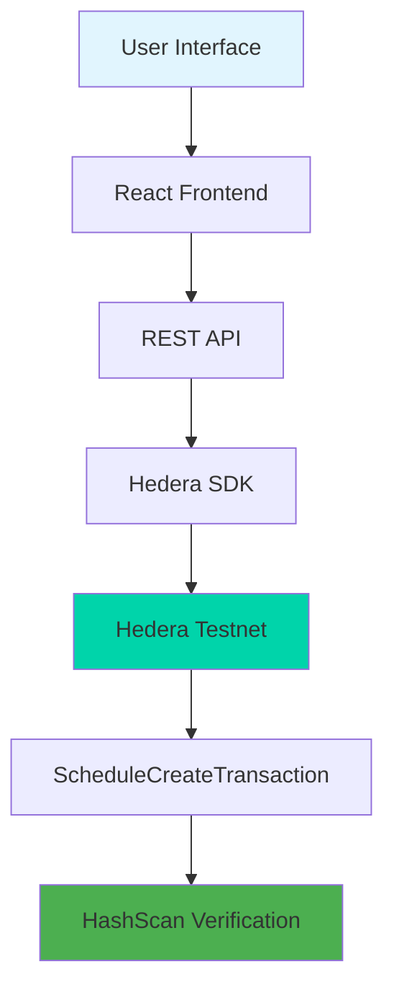

# 🚀 Axiom Pay - Decentralized Subscription Payments

<div align="center">


**The Future of Subscription Payments on Hedera**

[](https://testnet.hedera.com)
[](https://nodejs.org)
[](https://reactjs.org)
[](https://opensource.org/licenses/MIT)

[🎯 Live Demo](https://axiom-pay-demo.vercel.app) • [📖 Documentation](https://docs.axiom-pay.com) • [🛠️ API Reference](https://api.axiom-pay.com/docs)

</div>

---

## 🌟 Overview

**Axiom Pay** revolutionizes subscription payments by leveraging Hedera's cutting-edge blockchain technology. Say goodbye to centralized payment processors and hello to transparent, low-cost, and lightning-fast recurring payments.

### 🎯 The Problem We Solve

Traditional subscription services rely on centralized payment processors that charge high fees (2-3%), have slow settlement times (3-7 days), and lack transparency. Businesses lose revenue to fees while customers have no visibility into payment processing.

### 💡 Our Solution

Axiom Pay harnesses Hedera's **ScheduleCreateTransaction** feature to create truly decentralized subscriptions with:

- **💰 Ultra-Low Costs**: ~$0.0001 per transaction vs $0.30+ traditional fees
- **⚡ Lightning Speed**: 3-second finality vs 3-7 day settlements
- **🔍 Full Transparency**: All transactions verifiable on HashScan
- **🌱 Carbon Negative**: Eco-friendly blockchain technology
- **🛡️ Cryptographic Security**: Tamper-proof payment scheduling

---

## ✨ Key Features

<table>
<tr>
<td width="50%">

### 🏗️ **Decentralized Architecture**
- Built on Hedera's enterprise-grade blockchain
- No single points of failure
- Smart contract-like scheduling without smart contracts

### 💸 **Cost Revolution**
- Platform covers transaction fees for users
- 99.97% cost reduction compared to traditional processors
- Transparent fee structure

</td>
<td width="50%">

### 🔐 **Bank-Grade Security**
- Cryptographic proof of all transactions
- Immutable payment records
- Multi-signature support ready

### 🎨 **Seamless Experience**
- Intuitive React frontend
- One-click wallet integration
- Real-time payment verification

</td>
</tr>
</table>

---

## 🏗️ Technical Architecture



### 🔧 Technology Stack

<div align="center">

| Layer | Technology | Purpose |
|-------|------------|---------|
| **Frontend** | React + Tailwind CSS | Modern, responsive user interface |
| **Backend** | Node.js + Express | RESTful API and business logic |
| **Blockchain** | Hedera SDK | Blockchain integration and scheduling |
| **Network** | Hedera Testnet | Decentralized transaction processing |
| **Verification** | HashScan | Transaction transparency and proof |

</div>

---

## 🚀 Quick Start

### 📋 Prerequisites

- [Node.js 18+](https://nodejs.org/) and npm/pnpm
- [Hedera Testnet Account](https://portal.hedera.com) (free 1000 HBAR)
- Git

### ⚡ One-Minute Setup

```bash
# 1. Clone the repository
git clone https://github.com/yourusername/axiom-pay.git
cd axiom-pay

# 2. Install dependencies
npm run install:all

# 3. Configure environment
cp backend/.env.example backend/.env
# Edit backend/.env with your Hedera credentials

# 4. Start the application
npm run dev
```

🎉 **That's it!** Open http://localhost:5173 and start creating subscriptions!

---

## 🔧 Detailed Setup

<details>
<summary><b>📁 Project Structure</b></summary>

```
axiom-pay/
├── 🔧 backend/
│   ├── src/
│   │   ├── index.js           # Express server & API routes
│   │   ├── hederaService.js   # Hedera blockchain integration
│   │   └── utils/
│   │       ├── validation.js  # Input validation
│   │       └── logger.js      # Structured logging
│   ├── .env.example           # Environment template
│   └── package.json
├── 🎨 frontend/
│   ├── src/
│   │   ├── App.jsx            # Main React application
│   │   ├── components/
│   │   │   ├── WalletConnect.jsx
│   │   │   ├── SubscriptionForm.jsx
│   │   │   └── TransactionStatus.jsx
│   │   └── hooks/
│   │       └── useHedera.js   # Custom Hedera hooks
│   └── package.json
├── 📚 docs/                   # Additional documentation
├── 🧪 tests/                  # Test suites
└── 📋 scripts/                # Deployment scripts
```

</details>

<details>
<summary><b>🌐 Environment Configuration</b></summary>

### Backend Configuration (`.env`)

```env
# 🏗️ Hedera Network Configuration
HEDERA_NETWORK=testnet
PLATFORM_ACCOUNT_ID=0.0.YOUR_PLATFORM_ACCOUNT
PLATFORM_PRIVATE_KEY=YOUR_PLATFORM_PRIVATE_KEY
BUSINESS_ACCOUNT_ID=0.0.YOUR_BUSINESS_ACCOUNT

# 🔧 Server Configuration
PORT=3001
NODE_ENV=development
CORS_ORIGIN=http://localhost:5173

# 📊 Optional: Analytics & Monitoring
SENTRY_DSN=your_sentry_dsn_here
LOG_LEVEL=info
```

### 🔑 Getting Hedera Testnet Accounts

1. **Visit**: [Hedera Portal](https://portal.hedera.com)
2. **Create Account**: Free registration
3. **Get Test HBAR**: 1000 HBAR automatically credited
4. **Copy Credentials**: Account ID and Private Key
5. **Repeat**: Create 2-3 accounts for testing

</details>

---

## 📡 API Reference

### 🔄 Core Endpoints

<details>
<summary><b>POST /api/subscribe</b> - Create New Subscription</summary>

**Request:**
```json
{
  "userAccountId": "0.0.12345",
  "amountHbar": 50,
  "frequency": "monthly",
  "memo": "Netflix Subscription"
}
```

**Response:**
```json
{
  "status": "success",
  "data": {
    "scheduleId": "0.0.98765",
    "transactionId": "0.0.54321@1234567890.123456789",
    "hashscanUrl": "https://hashscan.io/testnet/schedule/0.0.98765",
    "estimatedExecution": "2024-01-15T10:00:00Z"
  }
}
```

</details>

<details>
<summary><b>GET /api/subscriptions/:accountId</b> - Get User Subscriptions</summary>

**Response:**
```json
{
  "status": "success",
  "data": {
    "subscriptions": [
      {
        "scheduleId": "0.0.98765",
        "amount": "50 HBAR",
        "frequency": "monthly",
        "status": "active",
        "nextPayment": "2024-01-15T10:00:00Z"
      }
    ]
  }
}
```

</details>

### 🔍 Testing Endpoints

```bash
# Health Check
curl https://api.axiom-pay.com/health

# Create Test Subscription
curl -X POST https://api.axiom-pay.com/api/subscribe \
  -H "Content-Type: application/json" \
  -d '{
    "userAccountId": "0.0.12345",
    "amountHbar": 10,
    "frequency": "one-time"
  }'
```

---

## 🧪 Testing & Verification

### 🔬 Automated Testing

```bash
# Run full test suite
npm test

# Run specific tests
npm run test:unit      # Unit tests
npm run test:integration # Integration tests
npm run test:e2e       # End-to-end tests
```

### 🌐 Manual Testing Flow

1. **🔗 Connect Wallet**: Click "Connect Wallet" (mock integration)
2. **💰 Set Amount**: Enter subscription amount (e.g., 50 HBAR)
3. **📅 Choose Frequency**: Select payment frequency
4. **✅ Create Subscription**: Submit and get Schedule ID
5. **🔍 Verify on HashScan**: Check transaction on blockchain

### 📊 HashScan Verification

All transactions are verifiable on [HashScan Testnet](https://hashscan.io/testnet):

- **Schedule Details**: View complete schedule information
- **Transaction History**: Track all related transactions
- **Account Balances**: Verify HBAR transfers
- **Timeline**: See exact execution times

---

## 🎯 Hackathon Demo

### 🎭 Demo Script (5 minutes)

1. **🎯 Problem Introduction** (30s)
   - "Traditional subscriptions charge 2-3% fees and take days to settle"

2. **💡 Solution Reveal** (60s)
   - "Axiom Pay uses Hedera for 99.97% cost reduction and 3-second finality"

3. **🚀 Live Demo** (2 minutes)
   - Connect wallet → Create subscription → Show HashScan verification

4. **📊 Benefits Showcase** (90s)
   - Cost comparison, speed demonstration, transparency proof

5. **🔮 Future Vision** (30s)
   - "Scaling to support millions of users and thousands of businesses"

### 🎯 Key Selling Points

<div align="center">

| Traditional Payments | 🆚 | Axiom Pay |
|---------------------|----|-----------| 
| 2-3% fees | **vs** | ~$0.0001 flat fee |
| 3-7 day settlement | **vs** | 3 second finality |
| Zero transparency | **vs** | Full blockchain visibility |
| Centralized risk | **vs** | Decentralized security |
| High carbon footprint | **vs** | Carbon negative |

</div>

---

## 🚀 Deployment

### 🌐 Production Deployment

<details>
<summary><b>Backend Deployment Options</b></summary>

#### Railway (Recommended)
```bash
# Install Railway CLI
npm install -g @railway/cli

# Login and deploy
railway login
railway init
railway up
```

#### Heroku
```bash
# Install Heroku CLI
heroku create axiom-pay-backend
git push heroku main
```

#### DigitalOcean App Platform
- Connect GitHub repository
- Set environment variables
- Deploy automatically

</details>

<details>
<summary><b>Frontend Deployment Options</b></summary>

#### Vercel (Recommended)
```bash
# Install Vercel CLI
npm install -g vercel

# Deploy
vercel --prod
```

#### Netlify
- Drag and drop `dist` folder
- Or connect GitHub for auto-deployment

</details>

### 🔒 Production Security Checklist

- [ ] Environment variables secured
- [ ] Private keys in secure storage (AWS Secrets, etc.)
- [ ] CORS configured for production domains
- [ ] Rate limiting implemented
- [ ] Input validation strengthened
- [ ] Logging and monitoring setup
- [ ] SSL/TLS certificates configured

---

## 🛣️ Roadmap

### 🎯 Phase 1: MVP (Current)
- [x] Basic subscription creation
- [x] Hedera integration
- [x] HashScan verification
- [x] Mock wallet connection

### 🚀 Phase 2: Production Ready (Q2 2024)
- [ ] Real wallet integration (HashPack, MetaMask)
- [ ] Recurring payment automation
- [ ] Business dashboard
- [ ] Advanced analytics
- [ ] Mobile responsive design

### 🌟 Phase 3: Scale (Q3-Q4 2024)
- [ ] Multi-token support (HTS tokens)
- [ ] Mobile application (React Native)
- [ ] Enterprise features
- [ ] Advanced reporting
- [ ] White-label solutions

### 🌍 Phase 4: Ecosystem (2025)
- [ ] API marketplace
- [ ] Plugin ecosystem
- [ ] Cross-chain bridges
- [ ] DeFi integrations
- [ ] Global expansion

---

## 🤝 Contributing

We welcome contributions from the community! Here's how to get started:

### 🛠️ Development Workflow

1. **Fork** the repository
2. **Clone** your fork: `git clone https://github.com/yourusername/axiom-pay.git`
3. **Create** feature branch: `git checkout -b feature/amazing-feature`
4. **Make** your changes
5. **Test** thoroughly: `npm test`
6. **Commit** with conventional commits: `git commit -m 'feat: add amazing feature'`
7. **Push** to branch: `git push origin feature/amazing-feature`
8. **Create** Pull Request

### 📋 Contribution Guidelines

- Follow [Conventional Commits](https://conventionalcommits.org/)
- Add tests for new features
- Update documentation
- Ensure CI/CD passes

---

## 📞 Support & Community

<div align="center">

### 🌐 Links & Resources

[](https://discord.gg/hedera)
[](https://twitter.com/axiompay)
[](https://docs.axiom-pay.com)
[](https://github.com/yourusername/axiom-pay/issues)

</div>

### 🆘 Getting Help

- **🐛 Bug Reports**: [Create an issue](https://github.com/yourusername/axiom-pay/issues/new?template=bug_report.md)
- **💡 Feature Requests**: [Submit an idea](https://github.com/yourusername/axiom-pay/issues/new?template=feature_request.md)
- **❓ Questions**: Join our [Discord server](https://discord.gg/hedera)
- **📖 Documentation**: Visit [our docs](https://docs.axiom-pay.com)

---

## 📄 License

This project is licensed under the **MIT License** - see the [LICENSE](LICENSE) file for details.

---

## 🎖️ Acknowledgments

<div align="center">

**Special thanks to:**

- 🌟 [Hedera](https://hedera.com) for the incredible blockchain technology
- 🏆 Hackathon organizers for the opportunity
- 👥 Open source community for inspiration and support
- ☕ Coffee for powering late-night coding sessions

</div>

---

<div align="center">

**🚀 Built with ❤️ for the Hedera Hackathon**

*Revolutionizing payments, one subscription at a time.*

⭐ **Star this repo if you found it helpful!** ⭐

</div>
